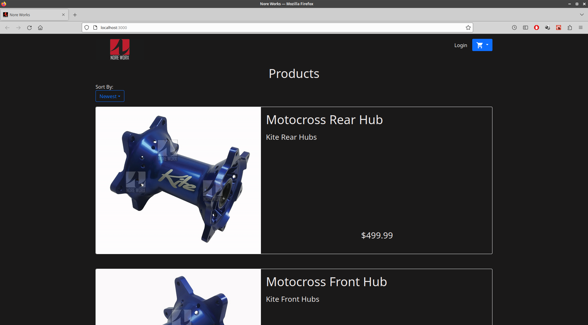
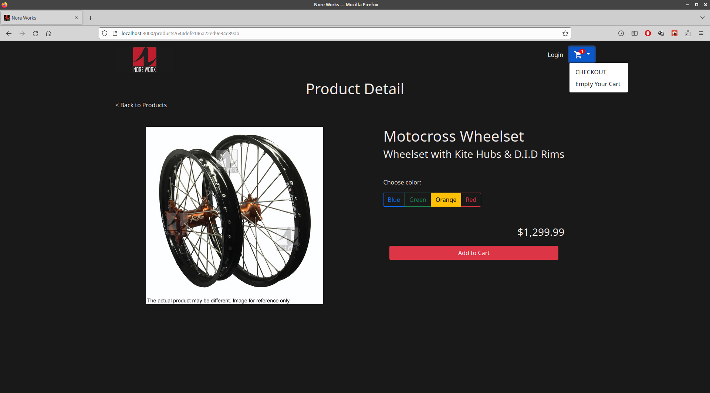
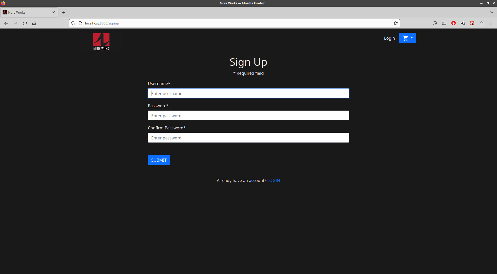
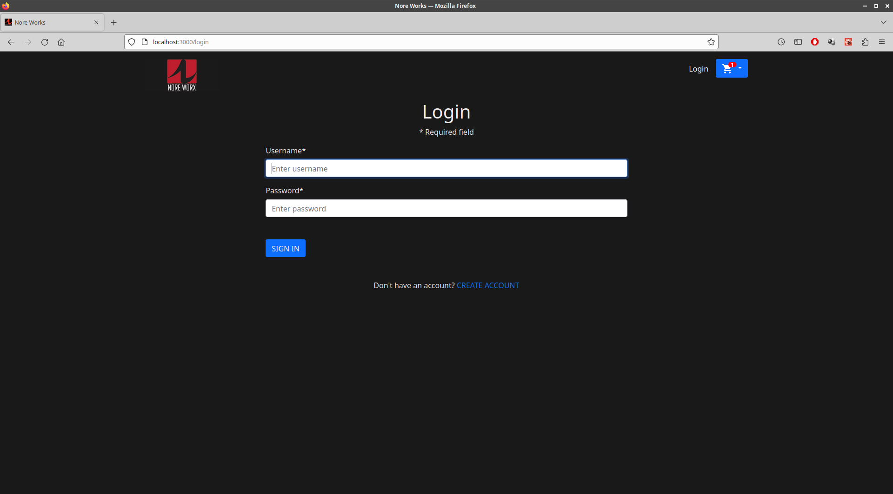
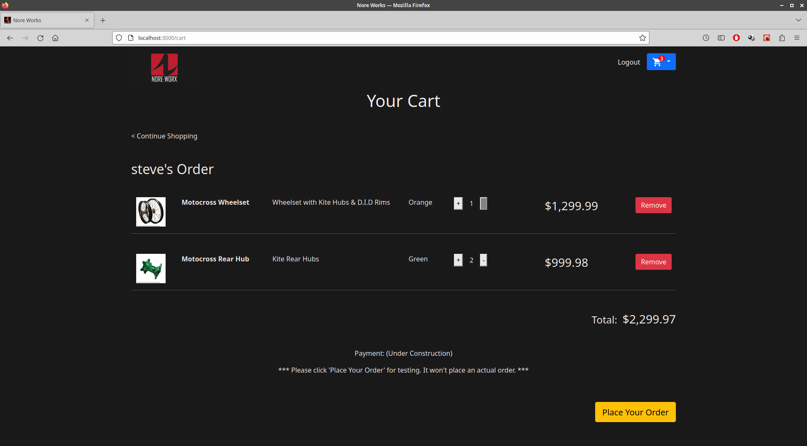
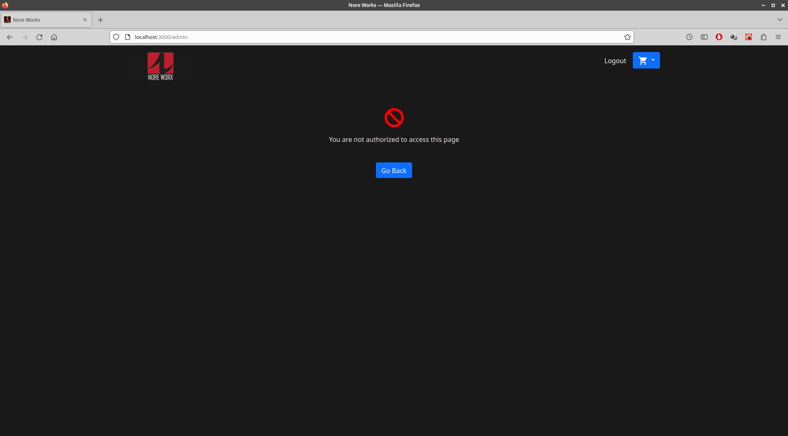
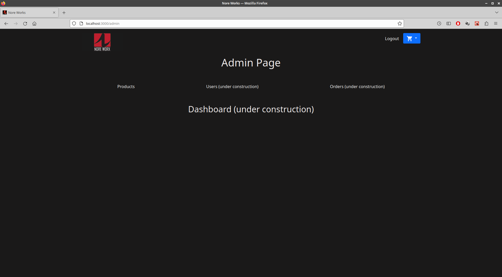
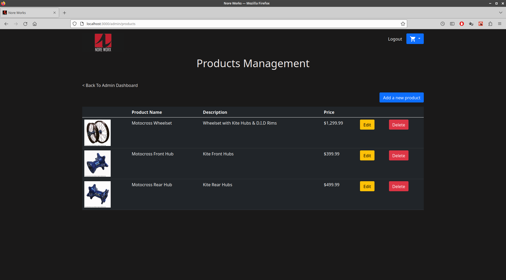

# MERN Stack E-Commerce Application with CRUD

## Table of Contents
---
- [Overview](#overview)
- [Built with](#built-with)
- [Features](#features)
- [Things To Be Improved](#things-to-be-improved)

## Overview
---

This is a responsive e-commerce application using MERN stack. In the shop page, customers can browse the products and add them to a cart for purchasing. After loging in, they can see info in the cart, modify the quantity for each item and place an order. In the admin page, only authorized admin user can add, edit and 
delete a product. This was a good project to learn a full stack with CRUD. 

&nbsp;
### Built With

#### Frontend:
- [React JS](https://reactjs.org/)
- [Bootstrop 5](https://getbootstrap.com/)

#### Backend:
- [Node JS](https://nodejs.org/en)
- [Express JS](https://expressjs.com/)

#### NoSQL Database:
- [MongoDB](https://www.mongodb.com/)

## Features
---
- The shop page is responsive to any screen sizes including a mobile
- Secure authentication with a jwt token including access and refresh token

## Things To Be Improved
----
1. Alternative way to save information such as items in a cart and an access token instead of using localStorage
2. Adding the payment function using such as Stripe
3. Adding a dashboard showing monthly sales, the number of access, etc. to the admin main page

